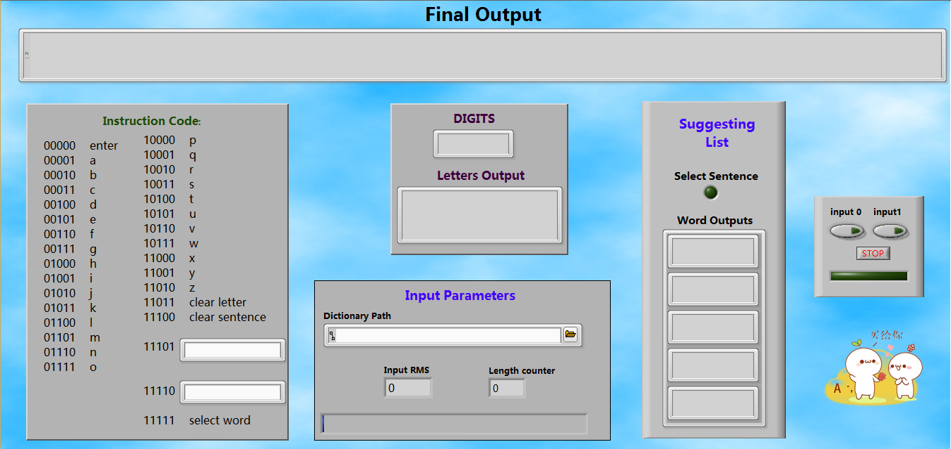
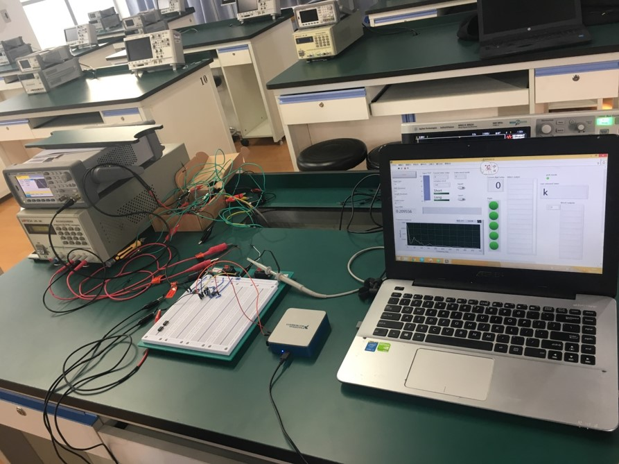
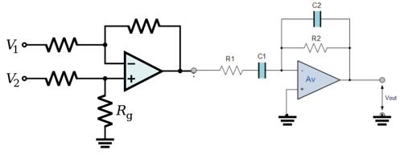
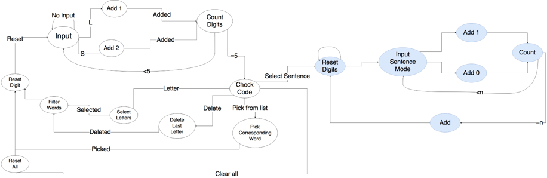

## Alternative-communication-with-single-muscle-EMG
ALS, also known as amyotrophic lateral sclerosis, is a disease causes the death of neurons which control voluntary muscle. In the situation, about 30% of people will lose their ability to communicate normally, requiring the use of technology to compensate. The goal of this project is to develop an alternative communication system based on single-muscle EMG signal input. The system should be cheap, and should allow patients affected by severe forms of ALS to communicate, even when they can only control a single muscle in their body. 

- Author: Group 7
- Instructor: Prof. Jiajia Luo
- Course: ve458 Biomedical Intrumentation and Design
- Date: Sep, 2017

## Team Member
- Xiuneng Lu ([@lUxIUNENG](https://github.com/LuXiuneng))
- Junwei Lin
- Yuxuan Wang
- Tommaso Cemmi

## Functions
- Transfer one single EMG Signal into words & sentences
- Increase efficiency by adding word suggestion dictionary
- Add quick access to some most commen used sentences

## Demo
Here's the GUI of our design: the top part is the word output, the left part is the instruction code for each letter. After several words are inputted, the "Suggesting list" will appear several words.

Here's the Demo Vedio:

## System
- Software: LabView
- Hardware: Lowpass Amplifire with robust gain, LabView DAQ

- Filter circuit diagram:

- Finite State Machine diagram:

